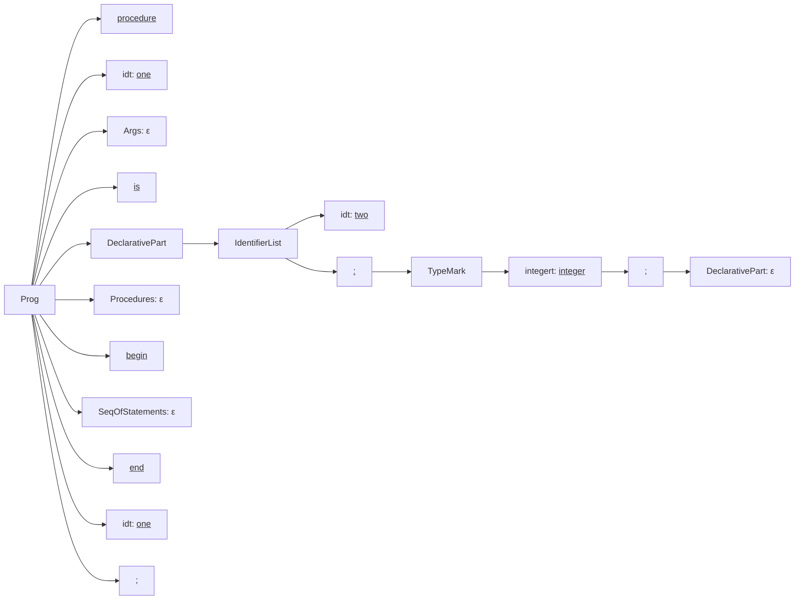

# John Akujobi
# Questions
### CSC 446
### Assignment #2

**Instructor:** Hamer  
**Due Date:** Monday, February 10

## Grammar Rules
### Given Grammar for a Subset of Ada
```
Prog           ->  procedure idt Args is
                   DeclarativePart
                   Procedures
                   begin
                   SeqOfStatements
                   end idt;

DeclarativePart -> IdentifierList : TypeMark ; DeclarativePart | ε

IdentifierList  -> idt | IdentifierList , idt

TypeMark       -> integert | realt | chart | const assignop Value 

Value          -> NumericalLiteral

Procedures     -> Prog Procedures | ε

Args           -> ( ArgList ) | ε

ArgList        -> Mode IdentifierList : TypeMark MoreArgs

MoreArgs       -> ; ArgList | ε

Mode           -> in | out | inout | ε

SeqOfStatements -> ε
```

---
## Programs
### Instructions
Draw the parse trees for the following programs. **Underline all tokens.**


#### **(a)**
```ada
procedure one is
    two : integer;
begin

end one;
```

#### **(b)**

```ada
procedure two is
    three, four : integer;
    procedure five is
    begin

    end five;
begin

end two;
```

#### **(c)**

```ada
procedure three is
    four, five : integer;
    procedure six ( in seven : integer ; eight : integer ) is
    begin

    end six;
begin

end three;
```

---

### **Hint:**

You may want to use your paper sideways for drawing the parse trees.

**Note:** Save this grammar as it will be used in the next assignment.

---
# Program 1
```pascal
procedure one is
    two : integer;
begin

end one;
```



