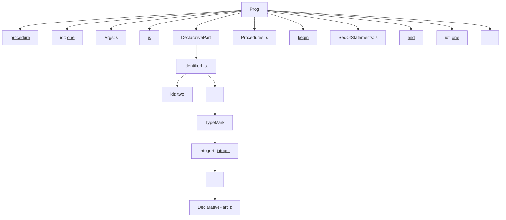

# John Akujobi
# Questions
(Copied and pasted from word doc)
### CSC 446
### Assignment #2
**Instructor:** Hamer  
**Due Date:** Monday, February 10

## Grammar Rules
### Given Grammar for a Subset of Ada
```
Prog           ->  procedure idt Args is
                   DeclarativePart
                   Procedures
                   begin
                   SeqOfStatements
                   end idt;

DeclarativePart -> IdentifierList : TypeMark ; DeclarativePart | ε

IdentifierList  -> idt | IdentifierList , idt

TypeMark       -> integert | realt | chart | const assignop Value 

Value          -> NumericalLiteral

Procedures     -> Prog Procedures | ε

Args           -> ( ArgList ) | ε

ArgList        -> Mode IdentifierList : TypeMark MoreArgs

MoreArgs       -> ; ArgList | ε

Mode           -> in | out | inout | ε

SeqOfStatements -> ε
```

---
## Programs
### Instructions
Draw the parse trees for the following programs. <u><b>Underline all tokens</b></u>
#### (a)
```ada
procedure one is
    two : integer;
begin

end one;
```

#### **(b)**
```ada
procedure two is
    three, four : integer;
    procedure five is
    begin

    end five;
begin

end two;
```

#### **(c)**
```ada
procedure three is
    four, five : integer;
    procedure six ( in seven : integer ; eight : integer ) is
    begin

    end six;
begin

end three;
```
---
### Hint:
You may want to use your paper sideways for drawing the parse trees.
**Note:** Save this grammar as it will be used in the next assignment.

---
# **Program 1**

```pascal
procedure one is
    two : integer;
begin

end one;
```

First broke it into this production
``Prog -> procedure idt Args is DeclarativePart Procedures begin SeqOfStatements end idt ;``

---
### Mermaid Code
I've used mermaid code for previous projects, and i used it's html properties to add the underlining.

```mermaidcode
flowchart TD
%% Top-level node for Program (a):
    A[Prog]
    A1[<u>procedure</u>]
    A2[idt: <u>one</u>]
    A3[Args: ε]
    A4[<u>is</u>]
    A5[DeclarativePart]
    A6[Procedures: ε]
    A7[<u>begin</u>]
    A8[SeqOfStatements: ε]
    A9[<u>end</u>]
    A10[idt: <u>one</u>]
    A11[<u>;</u>]

    A --> A1
    A --> A2
    A --> A3
    A --> A4
    A --> A5
    A --> A6
    A --> A7
    A --> A8
    A --> A9
    A --> A10
    A --> A11

    %% DeclarativePart subtree:
    A5 --> DP1[IdentifierList]
    DP1 --> DP2[idt: <u>two</u>]
    DP1 --> DP3[<u>:</u>]
    DP3 --> DP4[TypeMark]
    DP4 --> DP5[integert: <u>integer</u>]
    DP5 --> DP6[<u>;</u>]
    DP6 --> DP7[DeclarativePart: ε]

```

---
### First Visualization
I tried using the mermaid renderer of my markdown editor, Obsidian. But, it doesn't quite work well.


---
### Resolving to Mermaid Chart
I searched for other good mermaid editors online and found MermaidChart.

```cardlink
url: https://www.mermaidchart.com/
title: "Mermaid Chart - Create complex, visual diagrams with text. A smarter way of creating diagrams."
host: www.mermaidchart.com
favicon: https://www.mermaidchart.com/img/favicon.ico
```

---
### Visualized the Parse tree using Mermaid Code


The png file is attached to this homework pdf. Also, here is a card link to the image

```cardlink
url: https://github.com/jakujobi/Ada_Compiler_Construction/blob/main/A2%20-%20Parser/Program%20A%20-%20A2%20Parser-2025-02-10-064026.png
title: "Ada_Compiler_Construction/A2 - Parser/Program A - A2 Parser-2025-02-10-064026.png at main · jakujobi/Ada_Compiler_Construction"
description: "Compiler for ADA written in python for CSC 446. Contribute to jakujobi/Ada_Compiler_Construction development by creating an account on GitHub."
host: github.com
favicon: https://github.githubassets.com/favicons/favicon.svg
image: https://opengraph.githubassets.com/27daceb0e78cffea93d7a823a7d691b14dca7b26d5240560a7dace7ad2fbd478/jakujobi/Ada_Compiler_Construction
```


> [!NOTE]
> The `;` semicolon is formatted as underlined, but doesn't show clearly
> For example the semicolon below formatted as `<u>;</u>` doesn't display clearly
> <u>;</u>

---
# **Program 2**

```pascal
procedure two is
    three, four : integer;
    procedure five is
    begin

    end five;
begin

end two;
```
---
### Breakdown
Outer part
`Prog -> procedure idt Args is DeclarativePart Procedures begin SeqOfStatements end idt ;`

DeclarativePart
`DeclarativePart -> IdentifierList : TypeMark ; DeclarativePart`

Inner Procedure
`Procedures -> Prog Procedures

---
### Mermaid Code
```MermaidCode
flowchart LR
    B[Prog]
    B1[<u>procedure</u>]
    B2[idt: <u>two</u>]
    B3[Args: ε]
    B4[<u>is</u>]
    B5[DeclarativePart]
    B6[Procedures]
    B7[<u>begin</u>]
    B8[SeqOfStatements: ε]
    B9[<u>end</u>]
    B10[idt: <u>two</u>]
    B11[<u>;</u>]

    B --> B1
    B --> B2
    B --> B3
    B --> B4
    B --> B5
    B --> B6
    B --> B7
    B --> B8
    B --> B9
    B --> B10
    B --> B11

    %% DeclarativePart subtree for outer procedure:
    B5 --> BD1[IdentifierList]
    BD1 --> BD2[idt: <u>three</u>]
    BD2 --> BD3[<u>,</u>]
    BD3 --> BD4[idt: <u>four</u>]
    BD1 --> BD5[<u>:</u>]
    BD5 --> BD6[TypeMark]
    BD6 --> BD7[integert: <u>integer</u>]
    BD7 --> BD8[<u>;</u>]
    BD8 --> BD9[DeclarativePart: ε]

    %% Procedures subtree (nested procedure):
    B6 --> BP1[<b>Prog</>]
    BP1 --> BP2[<u>procedure</u>]
    BP1 --> BP3[idt: <u>five</u>]
    BP1 --> BP4[Args: ε]
    BP1 --> BP5[<u>is</u>]
    BP1 --> BP6[DeclarativePart: ε]
    BP1 --> BP7[Procedures: ε]
    BP1 --> BP8[<u>begin</u>]
    BP1 --> BP9[SeqOfStatements: ε]
    BP1 --> BP10[<u>end</u>]
    BP1 --> BP11[idt: <u>five</u>]
    BP1 --> BP12[<u>;</u>]
```

Also available as mermaid markdown file

---
### Parse Tree Visualized


[Ada_Compiler_Construction/A2 - Parser/Program 2 - A2 Parser-2025-02-10-071240.png at main · jakujobi/Ada_Compiler_Construction](https://github.com/jakujobi/Ada_Compiler_Construction/blob/main/A2%20-%20Parser/Program%202%20-%20A2%20Parser-2025-02-10-071240.png)

---
# Program 3
```pascal
procedure three is
    four, five : integer;
    procedure six ( in seven : integer ; eight : integer ) is
    begin

    end six;
begin

end three;
```

---
### Breakdown
Top level
`Prog -> procedure idt Args is DeclarativePart Procedures begin SeqOfStatements end idt ;`

Declarative subtree
`DeclarativePart -> IdentifierList : TypeMark ; DeclarativePart`

Nested procedure
`procedure six ( in seven : integer ; eight : integer ) is ... end six;`

---
### Mermaid Code

> [!warning]
> 
Unique error i found here was that mermaid has issues with rendering `(` parenthesis `)`. 

> [!success]
> So i searched and found a fix on stack overflow.
> - represent `(` with `#40;`
> - represent `)` with `#41;`
> - Also saw that there was a lot more that mermaid can do

```MermaidCode
flowchart TD
    C[Prog]
    C1[<u>procedure</u>]
    C2[idt: <u>three</u>]
    C3[Args: ε]
    C4[<u>is</u>]
    C5[DeclarativePart]
    C6[Procedures]
    C7[<u>begin</u>]
    C8[SeqOfStatements: ε]
    C9[<u>end</u>]
    C10[idt: <u>three</u>]
    C11[<u>;</u>]

    C --> C1
    C --> C2
    C --> C3
    C --> C4
    C --> C5
    C --> C6
    C --> C7
    C --> C8
    C --> C9
    C --> C10
    C --> C11

    %% DeclarativePart subtree for outer procedure:
    C5 --> CD1[IdentifierList]
    CD1 --> CD2[idt: <u>four</u>]
    CD2 --> CD3[<u>,</u>]
    CD3 --> CD4[idt: <u>five</u>]
    CD1 --> CD5[<u>:</u>]
    CD5 --> CD6[TypeMark]
    CD6 --> CD7[integert: <u>integer</u>]
    CD7 --> CD8[<u>;</u>]
    CD8 --> CD9[DeclarativePart: ε]

    %% Procedures subtree (nested procedure):
    C6 --> CP1[Prog (nested)]
    CP1 --> CP2[<u>procedure</u>]
    CP1 --> CP3[idt: <u>six</u>]
    CP1 --> CP4[Args]
    CP1 --> CP5[<u>is</u>]
    CP1 --> CP6[DeclarativePart: ε]
    CP1 --> CP7[Procedures: ε]
    CP1 --> CP8[<u>begin</u>]
    CP1 --> CP9[SeqOfStatements: ε]
    CP1 --> CP10[<u>end</u>]
    CP1 --> CP11[idt: <u>six</u>]
    CP1 --> CP12[<u>;</u>]

    %% Args subtree for nested procedure:
    %% Old one, nope didn't work
    %% CP4 --> CA1[<u>(</u>]
    %% CP4 --> CA2[ArgList]
    %% CP4 --> CA3[<u>)</u>]

    %% new one!
    CP4 --> CA1[<u>#40;</u>]
    CP4 --> CA2[ArgList]
    CP4 --> CA3[<u>#41;</u>]

    %% ArgList subtree:
    CA2 --> CA4[Mode: <u>in</u>]
    CA2 --> CA5[IdentifierList]
    CA5 --> CA6[idt: <u>seven</u>]
    CA2 --> CA7[<u>:</u>]
    CA2 --> CA8[TypeMark]
    CA8 --> CA9[integert: <u>integer</u>]
    CA2 --> CA10[MoreArgs]
    CA10 --> CA11[<u>;</u>]
    CA10 --> CA12[ArgList]
    CA12 --> CA13[Mode: ε]
    CA12 --> CA14[IdentifierList]
    CA14 --> CA15[idt: <u>eight</u>]
    CA12 --> CA16[<u>:</u>]
    CA12 --> CA17[TypeMark]
    CA17 --> CA18[integert: <u>integer</u>]
    CA12 --> CA19[MoreArgs: ε]
```